## Introduction

db2chart node is the Node-RED node to convert database data to the form that is compatible to Charts on Dashboard.

The input of db2chart node is the output of database node such as PostgreSQL node ([node-red-contrib-postgresql](https://flows.nodered.org/node/node-red-contrib-postgresql)), MySQL node ([node-red-node-mysql](https://flows.nodered.org/node/node-red-node-mysql)), SQL Server node ([node-red-contrib-mssql-plus](https://flows.nodered.org/node/node-red-contrib-mssql-plus)), SQLite node ([node-red-node-sqlite](https://flows.nodered.org/node/node-red-node-sqlite)) and other nodes that have the same output format as these nodes.  
And the output of db2chart node is the input of Chart nodes ([node-red-dashboard](https://github.com/node-red/node-red-dashboard)).

Example Input/Output of db2chart in [Appendix](#appendix).

## Prerequisites

db2chart node requires the following items to be installed.

- [Node-RED](https://nodered.org/) version 1.0.0 or later (We confirmed on 3.2.0)

## Installation

### Using npm
1. Check out the source code:  
    ```
    git clone https://github.com/pgspider/node-red-db2chart.git
    ```
1. Install db2chart to Node-RED environment:
    ```
    npm install <path-to-node-red-db2chart>
    ```

## Guidelines how to use db2chart

1. On the Node-RED flow editor, draw the following flow.  
    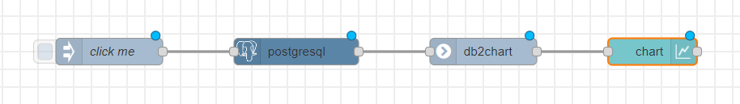
2. Double click on the PostgreSQL node to set configuration to connect to PostgreSQL database server and input a query to select data.  
    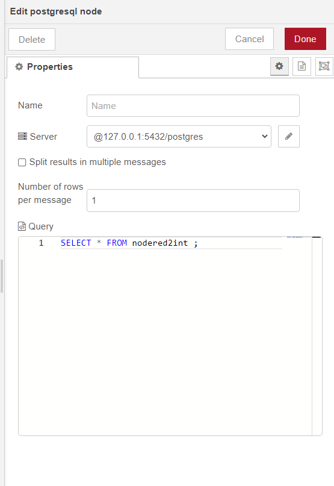
3. Double click on the db2chart node to set configuration if any, for example, set the first column as labels.  
    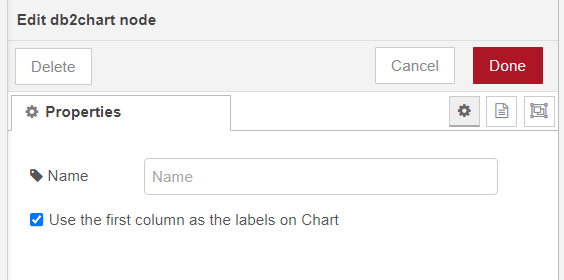
4. Double click on the chart node to set type of chart.  
    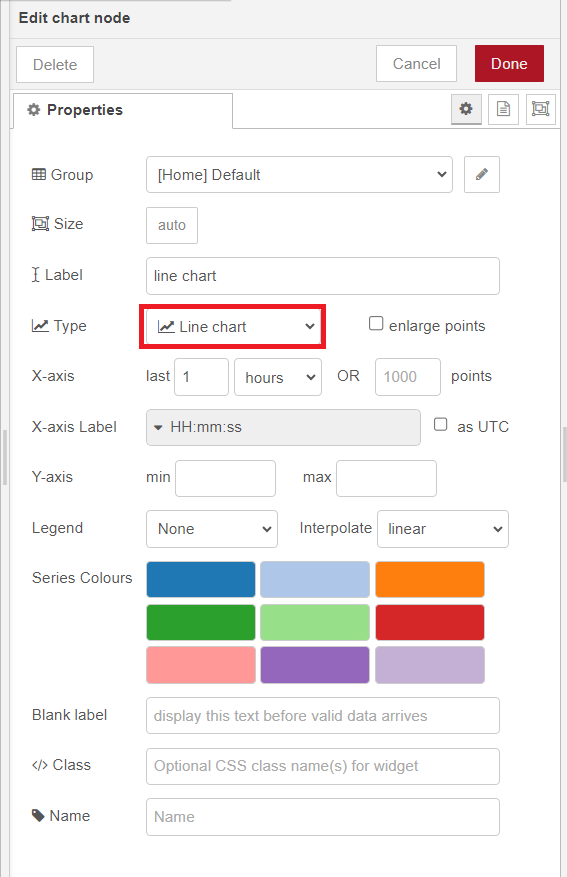
5. Click Deploy on the Node-RED editor.  
6. Click on the button of the Inject node "click me".  
7. Open the Dashboard to see the chart.  
    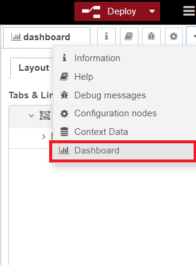

## Error messages

In case of error, the db2chart node will report error to the runtime, user can use Catch node to catch the error messages.
1. If the input message payload is neither array nor single object, the following error message will be reported.
    ```
    Invalid input message payload, neither array nor single object.
    ```
2. In case the message payload is an array, if the item in the array is not an object, the following error message will be reported, N is the position of the object in the array.
    ```
    Invalid object in the payload array at the index N.
    ```
3. If the object in the message payload has only one property (one column), and user marks it as label, the following error message will be reported.
    ```
    Cannot mark the first column as label.
    ```
4. In case the message payload is an array, if the items in the array are not consistent, for example, different properties, the following error message will be reported. N is the position of the object in the array that different from the first object.
    ```
    Object is inconsistent at the index N.
    ```
5. If column data in the object is not a Number, the following error message will be reported.
    ```
    Invalid data type, only Number is valid.
    ```

### Catch node

1.  Create the following flow with the Catch node.  
    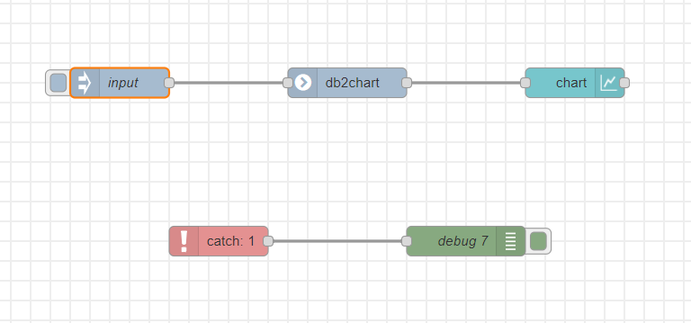
2. Double click on the Inject node to set an invalid message.  
    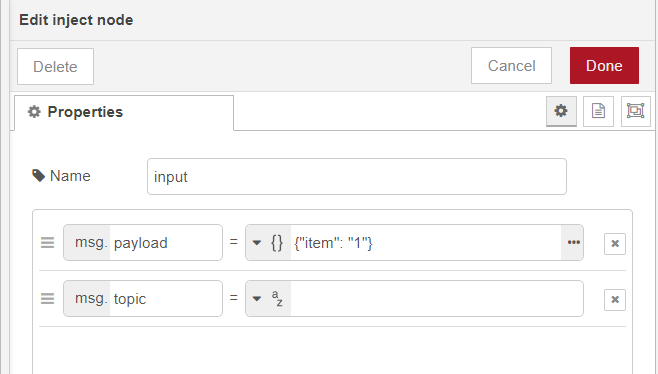
3. Double click on the Catch node to select db2chart node that Catch node will catch error message from.  
    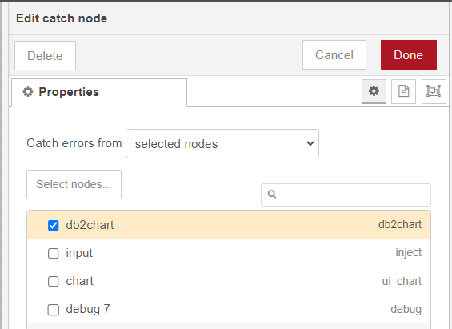
4. Double click on the Debug node to change the output to the complete message object.  
    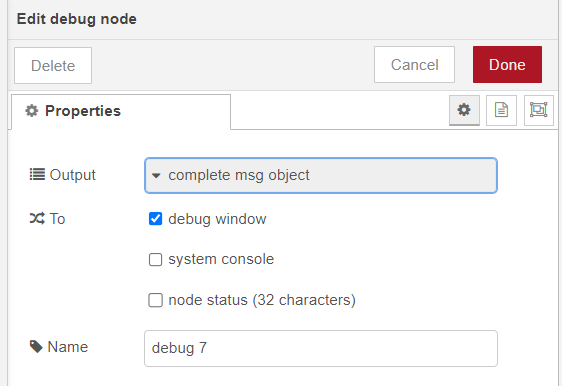
5. Click on the button Deploy on the editor, then click on the Inject node. The message object is shown on the Debug tab, then user can find the error message.  
    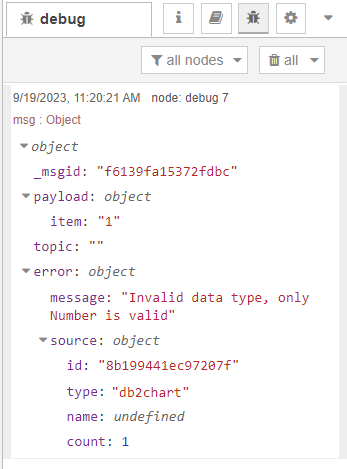

## Testing

The test suite requires the following software installed in addition to db2chart. (Numbers are versions which we used)
- [node-red-dashboard](https://flows.nodered.org/node/node-red-dashboard) (v3.5.0)
- [node-red-contrib-postgreql](https://flows.nodered.org/node/node-red-contrib-postgresql) (v0.13.0)
- [node-red-contrib-flowtest](https://github.com/steineey/node-red-contrib-flowtest) (v0.1.2)
- [PostgreSQL database server](https://www.postgresql.org/) (v15.0)

### Steps
1. Start PostgreSQL server
2. On the Node-RED editor, import the test flow located at test/TestCode.json.  
    2-1. Press Ctrl+i to open Import nodes interface.  
    2-2. Select TestCode.json and click the button Import.
3. On the flow editor, configure PostgreSQL node to connect to PostgreSQL DB server and do the following steps.  
    3-1. Prepare test data on PostgreSQL.  
    3-2. Execute each test by clicking on "click me" in each test case. The test result OK/Not OK is displayed on Assert node.

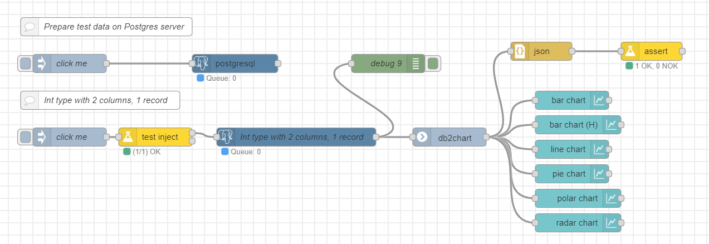

## Appendix

The input of db2chart is an array of rows. Each item in the array is a JSON object that represents a row in database, each object has the properties are columns. The format of the input message:  
```
[{col1: col1_value_1, col2: col2_value_1}, {col1: col1_value_2, col2: col2_value_2}]
```

The output of db2chart is an array that has only one JSON object and this object has 03 properties including series, data and labels. Each property is an array. The format of the output message like below:  
```
[{"series": ["col1", "col2"], "data": [[col1_value_1,col1_value_2], [col2_value_1,col2_value_2]], "labels": [0,1]}]
```

For example, the figure below will represent the table data on the bar chart. The horizontal axis represents labels, The vertical axis represents column data values, and when hovering mouse to the chart, series will be displayed.

| col1        | col2        |
| :---        | :---        |
| col1_value1 | col2_value1 |
| col1_value2 | col2_value2 |

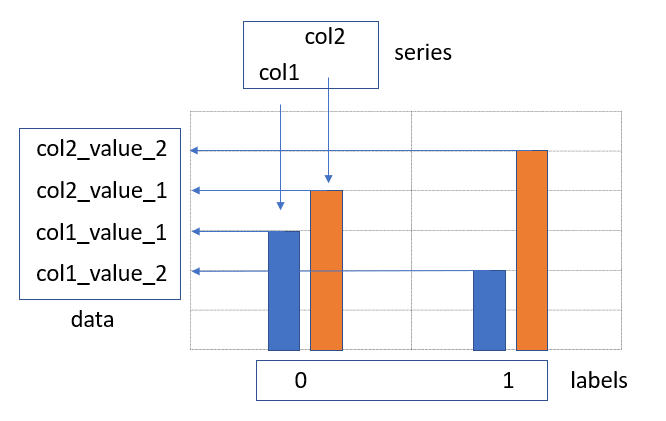

In case of using the first column as labels, the output message payload of db2chart is as follows.  
```
[{"series": ["col2"], "data": [[col2_value_1, col2_value_2]], "labels": ["col1_value1", "col1_value2"]}]
```

The bar chart will be displayed like this.

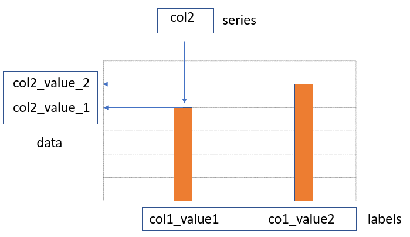


## Copyright and license

Copyright Toshiba Corporation under [the Apache 2.0 license](LICENSE).
